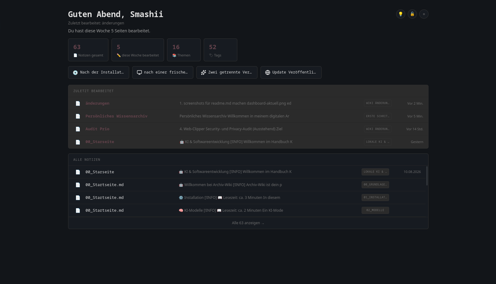
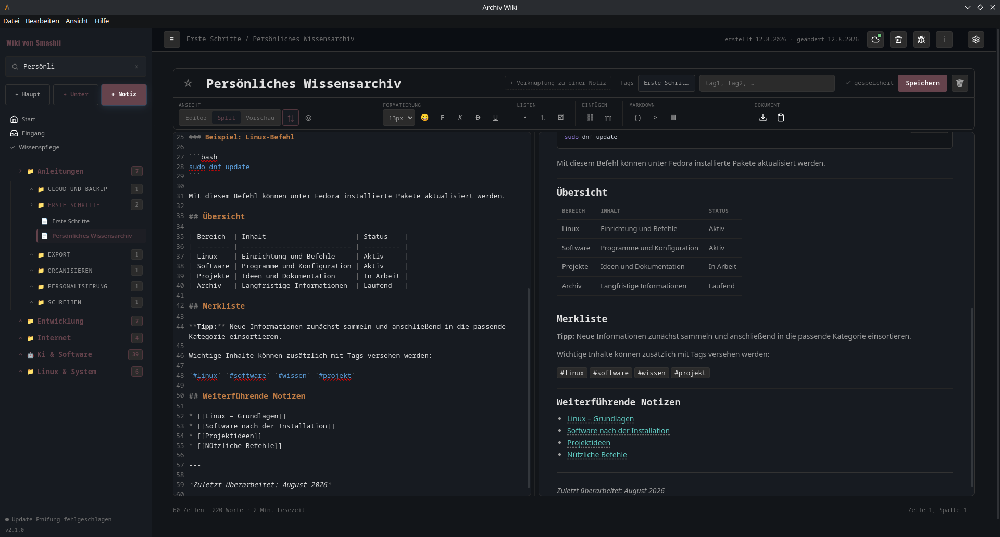
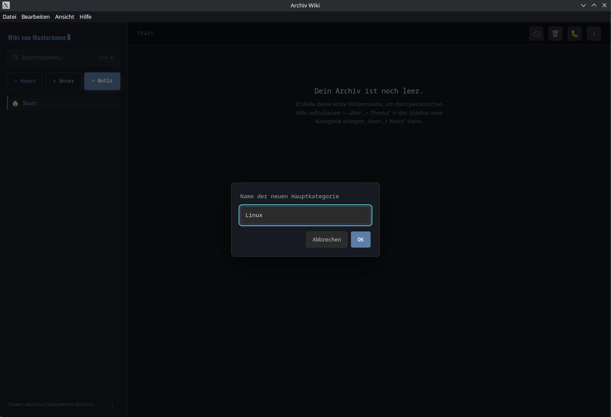
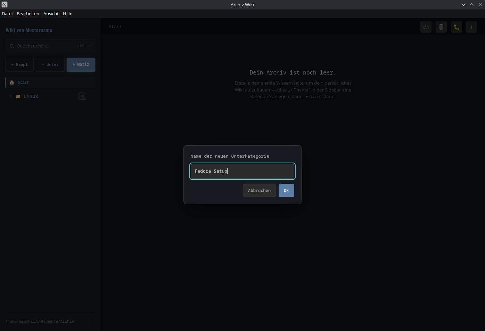
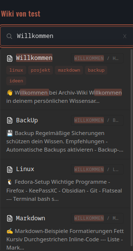
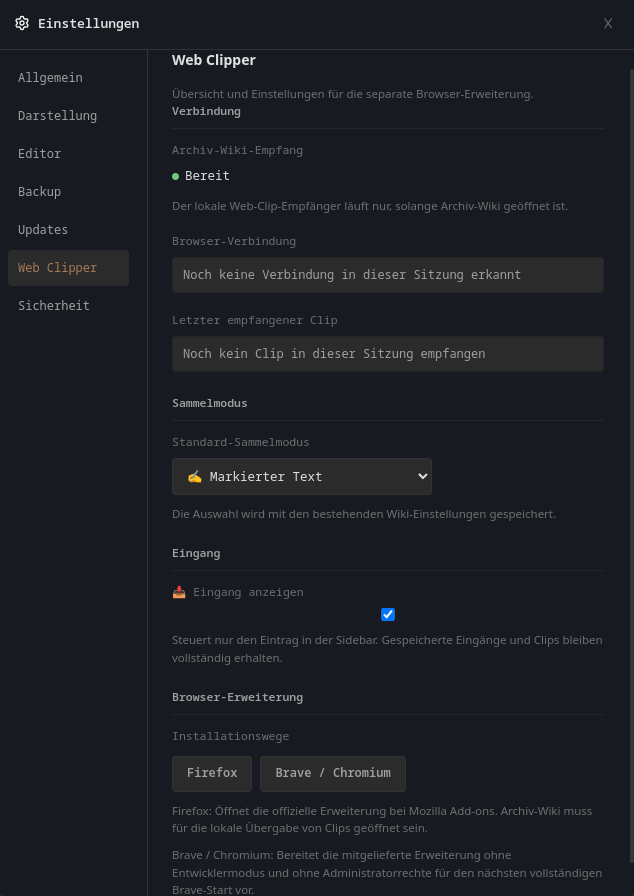
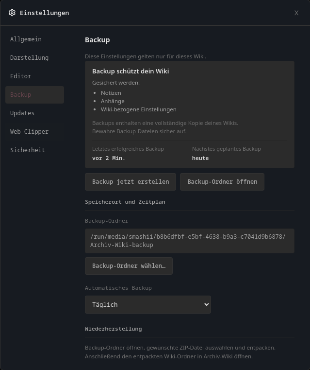
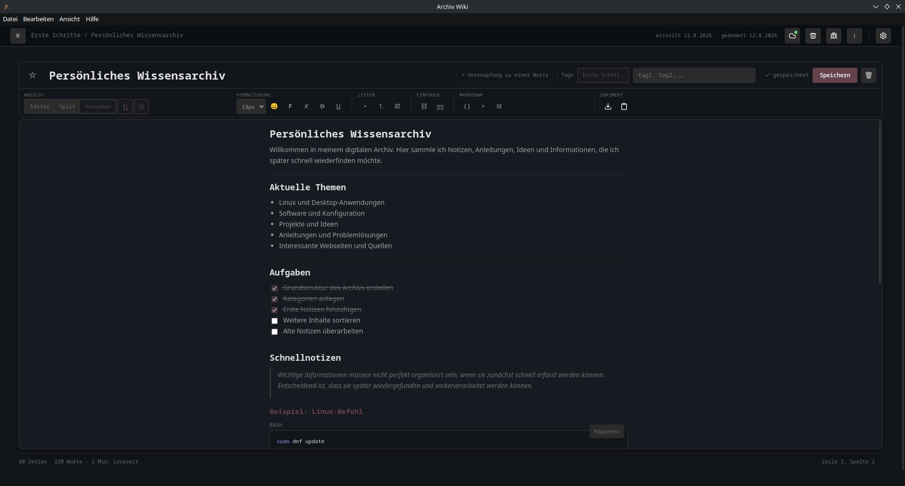
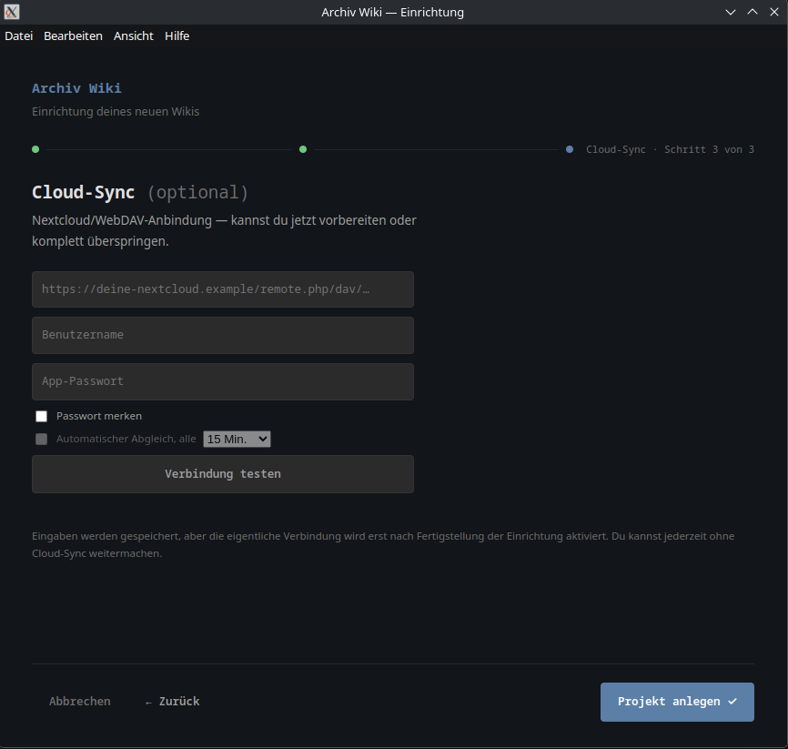

# Archiv-Wiki


**Ein persönliches Markdown-Wiki für den Linux-Desktop – für Notizen, Anleitungen, Setups und Checklisten.**

Archiv-Wiki speichert dein Wissen lokal in einem eigenen Projektordner. Es benötigt keinen Account, sendet keine Telemetriedaten und funktioniert ohne Cloud. Eine optionale WebDAV-Synchronisierung kann bei Bedarf zusätzlich eingerichtet werden.

## Kurzüberblick

- **Local First:** Deine Notizen bleiben als Markdown-Dateien in deinem eigenen Ordner.
- **Struktur statt Dateichaos:** Hauptkategorien, Unterkategorien, Tags und interne Verlinkungen schaffen Übersicht.
- **Schreiben und Lesen in einer Ansicht:** Markdown-Editor, Split-Ansicht und gerenderte Vorschau sind direkt integriert.
- **Schnell wiederfinden:** Die Volltextsuche durchsucht Titel, Inhalte, Tags und Kategorien.
- **Daten absichern:** Lokale Backups, Papierkorb und Exporte schützen vor versehentlichem Verlust.
- **Webinhalte sammeln:** Der Web Clipper übergibt URLs, markierten Text, sichtbaren Seitentext und gezielt ausgewählte Bilder lokal an den Eingang.
- **Optional synchronisieren:** WebDAV kann für den Abgleich mit einem eigenen Cloud-Speicher verwendet werden.

## Dashboard



Das Dashboard bündelt zuletzt bearbeitete, angepinnte und vorhandene Notizen. Statistiken und dezente Bedienhinweise geben Orientierung, ohne den persönlichen Arbeitsbereich zu überladen.

## Was ist Archiv-Wiki?

Archiv-Wiki ist eine Desktop-Anwendung für Wissen, das dauerhaft auffindbar bleiben soll: Installationsanleitungen, Problemlösungen, persönliche Dokumentationen, Ideen oder wiederkehrende Checklisten.

Statt Informationen über einzelne Textdateien, Haftnotizen, Browser-Lesezeichen und Chatverläufe zu verteilen, werden sie in einem lokalen Wiki gesammelt. Die Anwendung verbindet die Offenheit von Markdown mit einer festen, übersichtlichen Oberfläche – ohne Plugin-Pflicht und ohne Bindung an einen Online-Dienst.

## Die Anwendung

### Schreiben mit direkter Vorschau



Der Editor bietet Quelltext, Vorschau oder eine frei einstellbare Split-Ansicht. Werkzeugleiste, Kontextmenü und direkte Markdown-Syntax unterstützen unterschiedliche Arbeitsweisen.

### Wissen übersichtlich organisieren

<p align="center">
  
  
</p>

Haupt- und Unterkategorien bilden eine klare Baumstruktur für Notizen. Eigene Icons und die sichtbare Hierarchie erleichtern die Orientierung auch in umfangreicheren Wikis.

### Inhalte schnell wiederfinden

<p align="center">
  
</p>

Die Suche zeigt Titel, Textausschnitte, Tags und Kategoriepfade. Treffer werden hervorgehoben und lassen sich vollständig per Tastatur bedienen.

### Einstellungen an einem Ort



Allgemein, Darstellung, Editor, Backup, Updates, Web Clipper und Sicherheit sind in einem gemeinsamen Einstellungsfenster zusammengefasst.

### Lokale Backups



Backups können automatisch nach einem gewählten Zeitplan oder jederzeit manuell erstellt werden. Status, Speicherort und Hinweise zur Wiederherstellung bleiben direkt in der Anwendung sichtbar.

### Fokus-Modus



Der Fokus-Modus ist bei geöffneter Notiz verfügbar. Er blendet die Sidebar vollständig aus, vergrößert den Arbeitsbereich und wechselt vorübergehend zur Editoransicht, ohne diese Auswahl projektweit zu speichern. Kopfbereich, Werkzeugleiste und Statusbereich bleiben sichtbar und bedienbar; ein zurückhaltender neutraler Schatten hebt den Arbeitsbereich räumlich hervor.

## Funktionen

### Schreiben und Darstellen

- Markdown-Editor mit Editor-, Split- und Vorschauansicht
- frei verstellbare Split-Breite und optionale Lesebreite
- Formatierung über Werkzeugleiste, Kontextmenü oder Markdown-Syntax
- Tabellen, Checklisten, Bilder, Codeblöcke, Formeln und Hinweisblöcke
- Syntaxhervorhebung und Kopieren-Schaltfläche für Code
- eigene Notizvorlagen für wiederkehrende Inhalte
- Fokus-Modus für konzentriertes Schreiben und Lesen

### Organisieren

- Hauptkategorien, Unterkategorien und Notizen in einer festen Baumstruktur
- Tags für bereichsübergreifende Zuordnung
- interne Wikilinks mit `[[Notizname]]`
- angepinnte und zuletzt bearbeitete Notizen im Dashboard
- kuratierte Icons für Kategorien und Notizen
- Papierkorb mit Wiederherstellung vor dem endgültigen Löschen
- eigener Eingang für noch nicht verarbeitete Texte, Dateien, Bilder und Web-Clips, einschließlich Mehrfachauswahl und gemeinsamem Löschen
- gesammelte Inhalte lassen sich später gezielt zu normalen Notizen verarbeiten

### Suchen und Navigieren

- Volltextsuche über Titel, Inhalt, Tags und Kategorien
- verständliche Treffergründe und hervorgehobene Fundstellen
- Suche innerhalb einer geöffneten Notiz
- Wissenspflege zum Auffinden defekter Wikilinks, von Notizen ohne Tags und von leeren Notizen mit direktem Sprung zur betroffenen Notiz
- Kontextmenüs sowie umfassende Tastaturbedienung
- zentrale Übersicht der verfügbaren Tastenkürzel

### Daten und Sicherheit

- lokale Markdown-Dateien im frei gewählten Projektordner
- automatische und manuelle ZIP-Backups
- überprüfte Backup-Archive und sichere temporäre Speicherung
- Export als Markdown, HTML, PDF oder ZIP
- optionales App-Passwort
- verständliche Fehler- und Statusmeldungen

### Desktop-Komfort

- zentrale Einstellungen in den Bereichen Allgemein, Darstellung, Editor, Backup, Updates, Web Clipper und Sicherheit
- anpassbare Akzentfarbe, Sidebar-Größe und Editor-Schriftgröße
- lokaler Web Clipper für URLs, markierten Text, sichtbaren Seitentext und ausgewählte Bilder
- System-Tray mit wählbarem Verhalten beim Schließen
- integrierte Update-Prüfung mit Downloadfortschritt und Neustart
- optionale WebDAV-Synchronisierung mit einem eigenen Server oder Nextcloud
- ruhige Animationen und Unterstützung für reduzierte Bewegung

## Installation

Archiv-Wiki wird aktuell für **Linux** als AppImage bereitgestellt und auf **Fedora** getestet.

1. Öffne die [Releases](../../releases).
2. Lade die neueste Datei mit der Endung `.AppImage` herunter.
3. Markiere die Datei einmalig als ausführbar.
4. Starte Archiv-Wiki per Doppelklick.

### Ausführbar machen – grafisch

1. Rechtsklick auf die heruntergeladene Datei
2. **Eigenschaften** öffnen
3. Unter **Berechtigungen** die Ausführung als Programm erlauben
4. Datei per Doppelklick starten

### Ausführbar machen – Terminal

```bash
chmod +x Archiv-Wiki-*.AppImage
./Archiv-Wiki-*.AppImage
```

Beim ersten Start führt ein Einrichtungsassistent durch Projektordner, Wiki-Name und grundlegende Optionen. WebDAV ist optional; Archiv-Wiki kann vollständig lokal verwendet werden.



### Web Clipper in Firefox

Der Archiv-Wiki Web Clipper ist offiziell über [Mozilla Add-ons](https://addons.mozilla.org/de/firefox/addon/archiv-wiki-web-clipper/) verfügbar. Archiv-Wiki muss geöffnet sein, damit Firefox gesammelte Inhalte lokal an den Eingang übergeben kann.

### Web Clipper in Brave (Flatpak)

Die mitgelieferte, signierte Browser-Erweiterung lässt sich unter **Einstellungen → Web Clipper** mit **„Brave / Chromium“** benutzerbezogen für Brave als Linux-Flatpak vorbereiten. Dafür sind weder Entwicklermodus noch Administrator- oder Root-Rechte erforderlich. Danach muss Brave vollständig geschlossen und neu gestartet werden.

Eine bewusste Entfernung der Erweiterung in Brave wird respektiert und nicht automatisch rückgängig gemacht.

## Dokumentation

Weiterführende Anleitungen zur Einrichtung und Bedienung befinden sich im [GitHub-Wiki](../../wiki).

Änderungen und Downloads einzelner Versionen sind unter [Releases](../../releases) dokumentiert.

## Entwicklung mit KI-Unterstützung

Archiv-Wiki wurde von Anfang an mit umfangreicher Unterstützung durch KI-Werkzeuge und Coding-Assistenten entwickelt. Sie werden unter anderem für Code-Erstellung, Analyse, Fehlersuche, Dokumentation und Reviews eingesetzt. Planung, Funktionsumfang, Designentscheidungen, Tests und die Freigabe von Änderungen bleiben dabei menschlich gesteuert.

Von einer KI erzeugte oder vorgeschlagene Änderungen gelten nicht allein deshalb als korrekt oder fertig. Die tatsächliche Anwendung und ihr Verhalten werden geprüft und getestet.

Die KI-Unterstützung betrifft den Entwicklungsprozess; Archiv-Wiki selbst ist keine KI-Anwendung. Eigene Wiki-Daten bleiben grundsätzlich lokal, es gibt keine Telemetrie und kein Benutzerkonto. Optionale Dienste wie WebDAV werden nur auf Wunsch des Nutzers eingerichtet.

## Für Entwickler

Voraussetzung: **Node.js 18 oder neuer**.

```bash
git clone https://github.com/Smashinger/Archiv-Wiki.git
cd Archiv-Wiki
npm install
npm run dev
```

Ein AppImage wird mit folgendem Befehl in `dist/` erstellt:

```bash
npm run dist
```

## Lizenz

Archiv-Wiki steht unter der [MIT-Lizenz](LICENSE).

Lizenzen der verwendeten Bibliotheken, Schriftarten und Icon-Quellen sind in [THIRD_PARTY.md](THIRD_PARTY.md) aufgeführt.
