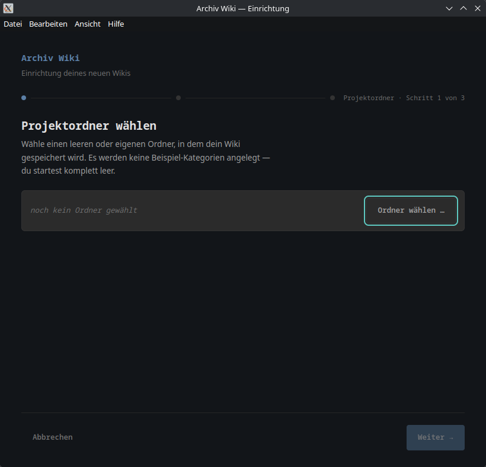
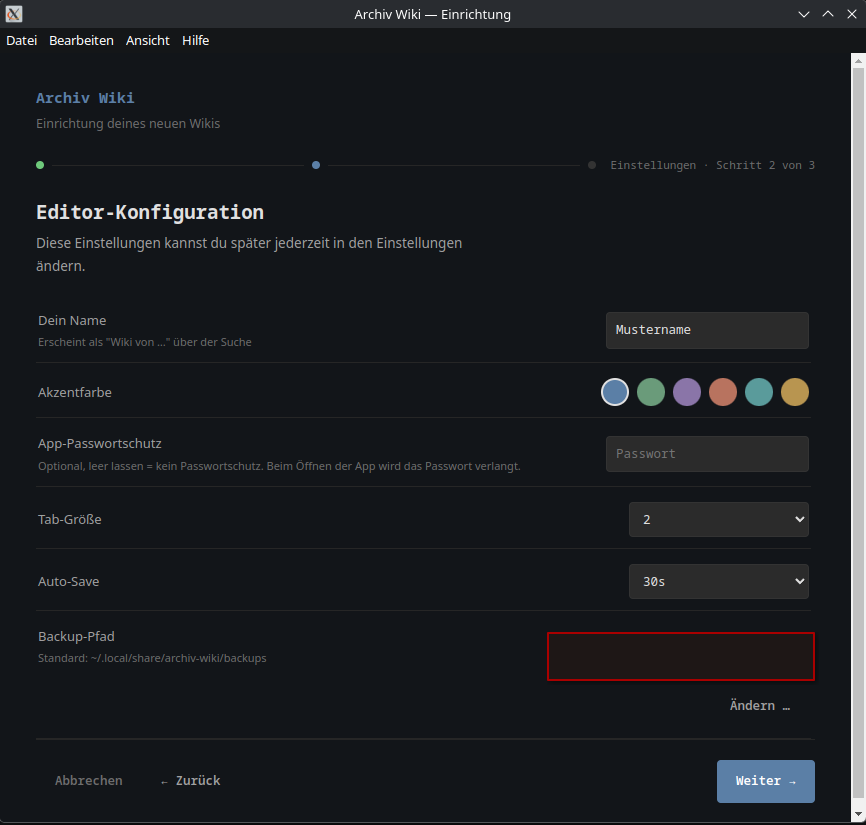
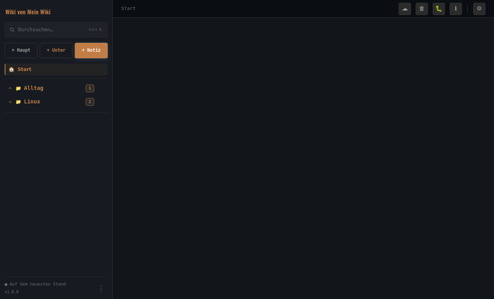
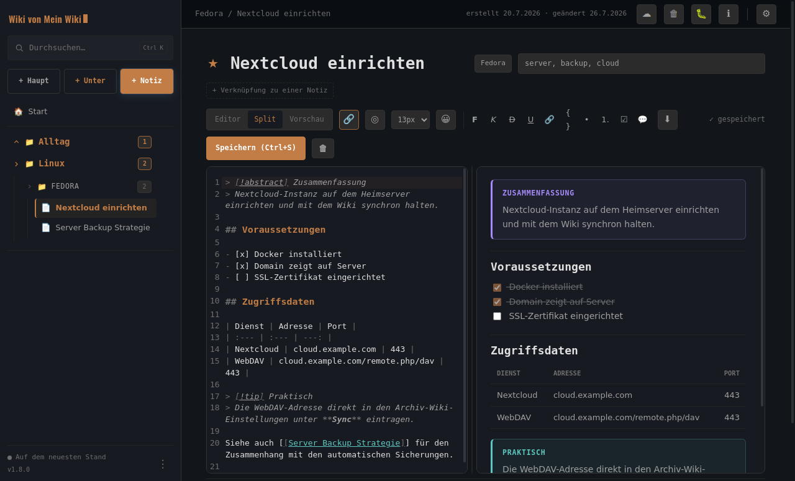

# Archiv Wiki


Ein persönliches Markdown-Wiki für den Desktop — Notizen, Setups und Checklisten, 100 % lokal. Keine Cloud-Pflicht, keine Telemetrie, kein Account nötig.

Gebaut mit [Electron](https://electronjs.org) für Linux (getestet auf Fedora).

## Was ist das?

Archiv Wiki organisiert Notizen in Haupt- und Unterkategorien, mit einem Markdown-Editor, der direkt neben einer Live-Vorschau sitzt. Gedacht für alles, was man sich sonst über mehrere Textdateien, Sticky Notes und Lesezeichen verteilt merkt: Setup-Anleitungen, Problemlösungen, Checklisten, persönliche Dokumentation.

## Screenshots

**Einrichtung**

| Projektordner wählen | Editor-Konfiguration | Cloud-Sync |
|---|---|---|
|  |  |  |

**Die App**

| Dashboard | Editor (Split-Ansicht) |
|---|---|
|  |  |

| Neue Hauptkategorie | Neue Unterkategorie |
|---|---|
|  |  |

## Funktionen

- **Editor mit Split-Ansicht** — Markdown-Quelltext und gerenderte Vorschau nebeneinander, Breite frei verstellbar
- **Callouts** — 7 farbcodierte Hinweisblöcke (Info, Tipp, Warnung, Gefahr, Zusammenfassung, Beispiel, Abstract)
- **Checklisten** — anklickbare Häkchen direkt in der Vorschau, werden in die Notiz zurückgeschrieben
- **Interne Verlinkung** — Notizen per `[[Name]]` oder `[[Ziel|eigener Text]]` miteinander verknüpfen, fehlende Notizen per Klick sofort anlegen
- **Code-Blöcke** mit Syntax-Highlighting und Kopieren-Button
- **Rechtsklick-Menü** im Editor — Formatierung, Absatz-Optionen, Tabellen, Hinweisblöcke einfügen, ohne die Maus zur Symbolleiste bewegen zu müssen
- **Volltextsuche** über alle Notizen
- **Startseite/Dashboard** — zuletzt bearbeitete Notizen getrennt von der Gesamtübersicht, mit automatischem Textausschnitt
- **Cloud-Sync** (Nextcloud/WebDAV) — Verbindungstest, reiner Upload, oder vollständiger Zwei-Wege-Abgleich mit Konflikterkennung; optional automatisch im Hintergrund
- **Automatisches lokales Backup** — tägliches ZIP-Backup, alte Versionen werden selbstständig aufgeräumt
- **Export** als PDF, HTML oder ZIP (ganzes Projekt)
- **Papierkorb** statt endgültigem Löschen

## Installation

Fertige Pakete gibt es unter [Releases](../../releases):

- **AppImage** (läuft auf jeder Linux-Distribution ohne Installation):
  ```bash
  chmod +x Archiv-Wiki-*.AppImage
  ./Archiv-Wiki-*.AppImage
  ```

## Selbst bauen

```bash
git clone git@github.com:Smashinger/archiv-wiki.git
cd archiv-wiki
npm install
npm run dev      # zum Ausprobieren/Entwickeln
npm run dist     # baut AppImage in dist/
```

## Lizenz

MIT — siehe [LICENSE](LICENSE).

Verwendete Drittanbieter-Bibliotheken, Schriftart und Icon-Quellen samt ihrer
jeweiligen Lizenzen: siehe [THIRD_PARTY.md](THIRD_PARTY.md).
