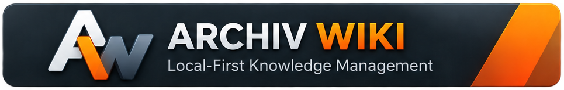
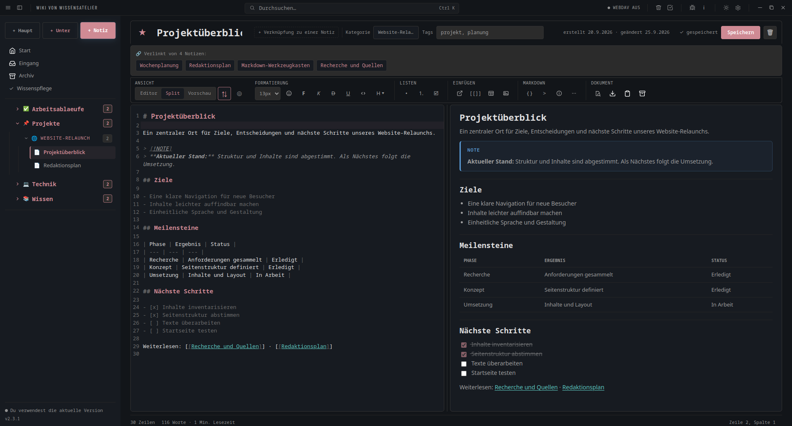
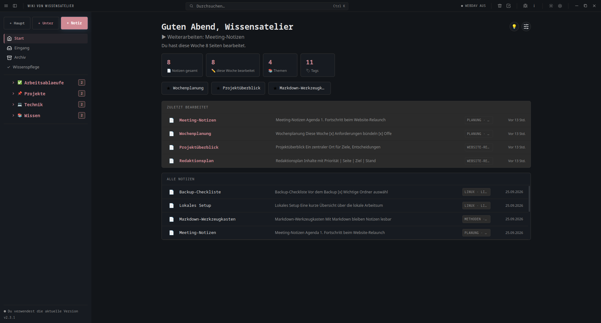
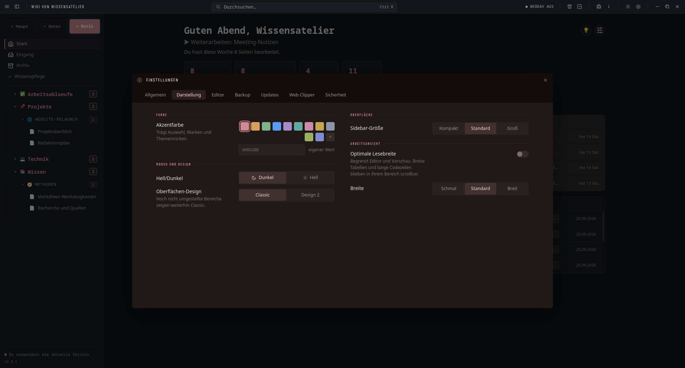
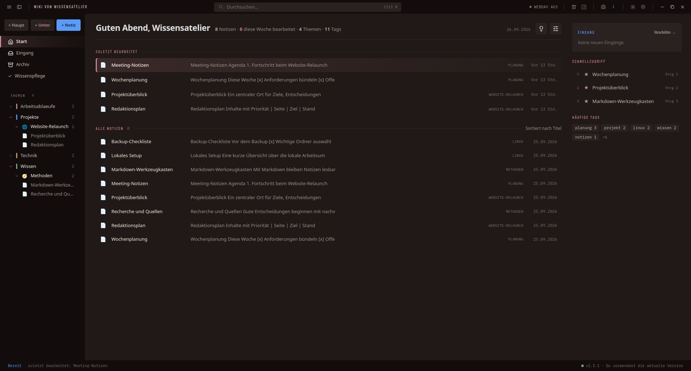

# Archiv-Wiki



**Ein persönliches Markdown-Wiki für den Linux-Desktop – für Notizen, Anleitungen, Setups und Checklisten.**

Archiv-Wiki speichert dein Wissen lokal in einem frei wählbaren Ordner als verständliche Markdown-Dateien. Du kannst deine Notizen ohne Internet bearbeiten; ein Konto ist nicht nötig und es gibt keine Telemetrie. Für die optionale WebDAV-Synchronisierung und die standardmäßig aktivierte Update-Prüfung wird eine Internetverbindung verwendet.

---

## Auf einen Blick

- **Local First:** Notizen liegen als lesbare `.md`-Dateien in deinem Dateisystem – volle Kontrolle ohne Vendor-Lock-in.
- **Zweigeteilter Editor:** Leistungsfähige Split-Ansicht mit synchronem Scrollen, Live-Vorschau und moderner Werkzeugleiste.
- **Struktur & Hierarchie:** Haupt- und Unterkategorien mit eigenen Icons, Tags, Backlinks und Favoriten.
- **Web Clipper:** Schnelles Sammeln von Web-Artikeln, Codeblöcken und Bildern aus Firefox, Brave und Chromium direkt in den Eingang.
- **Volltextsuche & Wissenspflege:** Schnelles Finden nach Begriffen, Tags oder Kategorien sowie automatische Erkennung verwaister oder defekter Links.
- **Datensicherheit:** Automatische und manuelle ZIP-Backups, Papierkorb mit Wiederherstellung und optionaler Passwortschutz.

---

## Einblicke

### Schreiben mit Live-Vorschau (Split-Ansicht)

Der Editor verbindet direktes Markdown-Schreiben mit einer synchronen Vorschau. Codeblöcke mit Syntaxhervorhebung, mathematische Formeln (KaTeX), Hinweisblöcke (Callouts), Tabellen und interne Wiki-Links (`[[Notiz]]`) werden in Echtzeit gerendert.



### Zentrales Dashboard

Das Dashboard bietet beim Programmstart einen schnellen Überblick über kürzlich bearbeitete Seiten, angepinnte Favoriten, Wiki-Statistiken und die Notizstruktur.



### Anpassbare Oberfläche & Einstellungen

Über das zentrale Einstellungsfenster lassen sich Akzentfarben, Modus (Dunkel/Hell), Sidebar-Größe, Lesebreite, Backups, Updates und Web Clipper bequem konfigurieren.



### Classic und Design 2

**Classic ist das vorgesehene Standarddesign.** Design 2 ist eine wählbare Alternative mit neu gestalteter Kopf- und Themenleiste. Du kannst unter **Einstellungen → Darstellung** jederzeit wechseln:



**Hinweis:** Neue Wikis starten standardmäßig mit Classic. Bereits bestehende Wiki-Einstellungen werden nicht automatisch geändert.

---

## Funktionen

### Schreiben und Gestalten
- **Flexible Ansichten:** Wähle zwischen reinem Editor, synchroner Split-Ansicht oder voller Vorschau.
- **Formatierung:** Schneller Zugriff über Werkzeugleiste, Kontextmenü oder gewohnte Markdown-Syntax.
- **Erweiterte Elemente:** Tabellen (mit interaktivem Raster einfügen), Checklisten, KaTeX-Formeln, Callouts (`> [!TIP]`, `> [!NOTE]`) und Bilder.
- **Bilder unkompliziert einfügen:** Bilder direkt aus der Zwischenablage per `Strg+V` oder über den Dateidialog einbetten.
- **Code mit Komfort:** Syntaxhervorhebung für gängige Sprachen mit praktischer Kopieren-Schaltfläche.
- **Fokus-Modus:** Blendet die Navigation für ablenkungsfreies Arbeiten vollständig aus (`Strg+Umschalt+F`).

### Struktur und Wissensvernetzung
- **Kategorienbaum:** Haupt- und Unterkategorien mit anpassbaren Icons für eine saubere Themenstruktur.
- **Wiki-Links:** Notizen mit doppelten eckigen Klammern `[[Zielnotiz]]` vernetzen; eingehende Verlinkungen (Backlinks) werden automatisch am Notizkopf angezeigt.
- **Tags & Favoriten:** Verschlagwortung über Tags sowie Anpinnen wichtiger Seiten direkt auf das Dashboard.
- **Wissenspflege:** Findet defekte Verlinkungen, Notizen ohne Tags oder leere Einträge mit direktem Korrektursprung.
- **Eingang:** Lokaler Zwischenspeicher für Web-Clips, Notizen und Textfragmente, die erst später einsortiert werden sollen.

### Suchen und Finden
- **Echtzeit-Volltextsuche:** Durchsucht blitzschnell Titel, Textinhalte, Kategorien und Tags.
- **Hervorgehobene Fundstellen:** Zeigt gefundene Textausschnitte mit Markierung an.
- **Tastaturfokus:** Vollständig per Tastatur bedienbar (`Strg+K`).

### Datensicherheit und Privatsphäre
- **Eigene Dateien:** Notizen bleiben ganz normale `.md`-Dateien auf deiner Festplatte.
- **Backups:** Automatische Zeitplan-Backups oder manuelle ZIP-Archive mit Integritätsprüfung.
- **Papierkorb:** Gelöschte Notizen landen im Papierkorb und können jederzeit wiederhergestellt werden.
- **Optionales App-Passwort:** Schützt das Öffnen der Anwendung; das Passwort wird nicht im Klartext gespeichert.
- **Optionale Cloud-Synchronisation:** WebDAV-Integration für eigene Nextcloud-, ownCloud- oder Server-Instanzen.

---

## Installation

Archiv-Wiki wird für **Linux** als transportables AppImage bereitgestellt und auf **Fedora** entwickelt und getestet.

1. Öffne die [Releases](https://github.com/Smashinger/Archiv-Wiki/releases).
2. Lade die neueste `.AppImage`-Datei herunter.
3. Mache die Datei ausführbar und starte sie.

### Ausführbar machen – grafisch
1. Rechtsklick auf die Datei `Archiv-Wiki-*.AppImage` → **Eigenschaften**.
2. Im Reiter **Berechtigungen** die Option *„Ausführen der Datei als Programm erlauben“* aktivieren.
3. Datei per Doppelklick starten.

### Ausführbar machen – Terminal
```bash
chmod +x Archiv-Wiki-*.AppImage
./Archiv-Wiki-*.AppImage
```

Beim ersten Start führt ein kompakter Einrichtungsassistent durch die Auswahl des Wiki-Speicherorts und grundlegende Optionen.

---

## Web Clipper

Mit dem Web Clipper lassen sich Webseiten, markierte Absätze oder Bilder direkt vom Browser lokal in den Eingang von Archiv-Wiki übergeben:

- **Firefox:** Offiziell über [Mozilla Add-ons](https://addons.mozilla.org/de/firefox/addon/archiv-wiki-web-clipper/) verfügbar.
- **Brave (Flatpak):** Lässt sich unter **Einstellungen → Web Clipper** mit einem Klick für Brave als Linux-Flatpak registrieren – ganz ohne Administratorrechte.
- **Chromium (System):** Ebenfalls unter **Einstellungen → Web Clipper** für systemweit installierte Chromium-Browser vorkonfigurierbar.

*Hinweis: Archiv-Wiki muss geöffnet sein, um Clips aus dem Browser lokal zu empfangen.*

---

## Änderungen

Neuigkeiten und Änderungsprotokolle einzelner Versionen stehen bei den [Releases](https://github.com/Smashinger/Archiv-Wiki/releases).

---

## Entwicklung & Datenschutz

Archiv-Wiki wurde von Anfang an mit Unterstützung moderner KI-Werkzeuge und Coding-Assistenten entwickelt (Code-Erstellung, Tests, Dokumentation und Reviews). Planung, Funktionsumfang, Designentscheidungen und finale Freigaben bleiben dabei vollständig menschlich gesteuert.

## Für Entwickler

Voraussetzung: **Node.js 18 oder neuer**.

```bash
git clone https://github.com/Smashinger/Archiv-Wiki.git
cd Archiv-Wiki
npm install
npm run dev
```

Ein AppImage wird mit folgendem Befehl in `dist/` erstellt:

```bash
npm run dist
```

## Lizenz

Archiv-Wiki steht unter der [MIT-Lizenz](LICENSE).

Lizenzen der verwendeten Bibliotheken, Schriftarten und Icon-Quellen sind in [THIRD_PARTY.md](THIRD_PARTY.md) aufgeführt.
