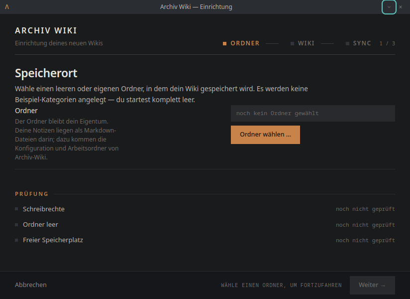
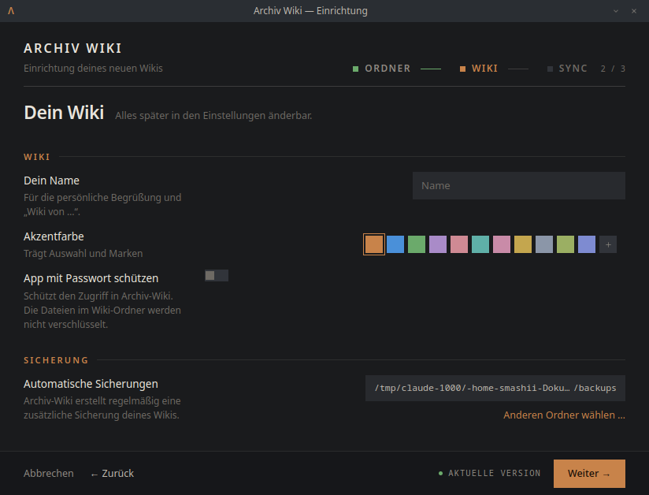
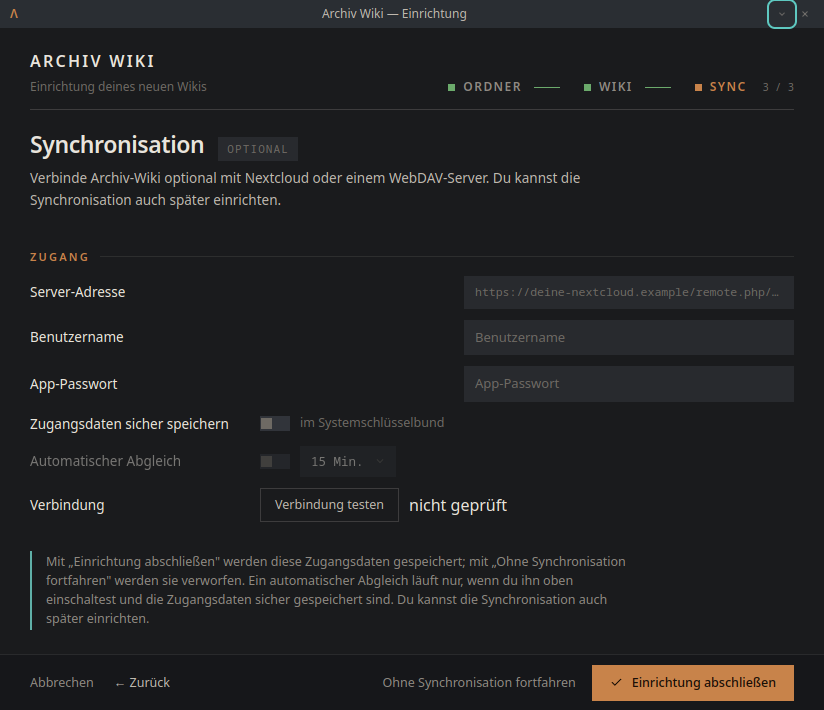

# Bericht: Einrichtungsmenü (Setup-Wizard)

Stand: 03.09.2026 · betrifft die überarbeitete Ersteinrichtung von Archiv-Wiki.

Das Einrichtungsmenü ist der Assistent, der beim **allerersten Start** (oder wenn
noch kein gültiges Projekt bekannt ist) erscheint. Es führt in **drei Schritten**
durch das Anlegen eines neuen Wikis. Die Optik (rahmenloses Fenster, Titelleiste,
Schrittleiste, Zeilenform, Fußleiste) stammt aus dem zuvor abgeschlossenen
Design-Umbau und ist unverändert; überarbeitet wurden **Optionen und Texte**.

Screenshots: `screenshots/14_einrichtung_speicherort.png`,
`screenshots/15_einrichtung_dein_wiki.png`,
`screenshots/16_einrichtung_synchronisation.png`.

---

## Aufbau

Drei Schritte, in der Schrittleiste oben rechts kurz beschriftet:

| Schritt | Titel | Kurzlabel |
| --- | --- | --- |
| 1 | Speicherort | Ordner |
| 2 | Dein Wiki | Wiki |
| 3 | Synchronisation | Sync |

Fensterrahmen: eigene 28-px-Titelleiste (Minimieren/Schließen), darunter der
Inhalt, unten eine feste Fußleiste. Der Assistent scrollt nicht — das Fenster
passt seine Höhe an den Inhalt an.

---

## Schritt 1 — Speicherort

Auswahl des Ordners, in dem das Wiki gespeichert wird. Der gewählte Pfad wird
mittig gekürzt angezeigt (Anfang kürzbar, Ende immer lesbar), darunter der Knopf
**„Ordner wählen …"**. Es wird **nichts** in den Ordner geschrieben, bevor die
Einrichtung ganz abgeschlossen ist.

Der Abschnitt **PRÜFUNG** zeigt drei Ergebnisse mit echten Werten:

- **Schreibrechte** — „beschreibbar" / „nicht beschreibbar"
- **Ordner leer** — „leer" oder Anzahl vorhandener Einträge
- **Freier Speicherplatz** — z. B. „344 GB frei"

Drei Ordner-Fälle werden klar unterschieden:

1. **Leerer, beschreibbarer Ordner** → normales Fortfahren mit „Weiter →".
2. **Ordner enthält bereits ein Archiv-Wiki-Projekt** → Hinweis mit
   **„Direkt öffnen →"**; die vorhandene Konfiguration wird nicht überschrieben.
3. **Beschreibbarer, nicht-leerer Ordner ohne Projekt** → sichtbare Warnung
   („Deine vorhandenen Dateien bleiben erhalten; Archiv-Wiki legt nur seine
   eigene Konfiguration und Arbeitsordner darin an."). Beim „Weiter →" folgt
   eine **ausdrückliche Bestätigung**. Abbrechen bleibt auf Schritt 1; die Wahl
   eines anderen Ordners setzt eine frühere Bestätigung zurück.

Solange kein beschreibbarer, nicht bereits konfigurierter Ordner gewählt ist,
bleibt „Weiter →" deaktiviert (mit Begründung in der Fußleiste).

---

## Schritt 2 — Dein Wiki

Abschnitt **WIKI**:

- **Dein Name** — für die persönliche Begrüßung und „Wiki von …". Dieser Wert ist
  kein Wiki-Titel und ändert nichts an der App-Marke.
- **Akzentfarbe** — elf feste Farbfelder plus ein Eigenwert-Feld für eine freie
  Farbe.
- **App mit Passwort schützen** — ein standardmäßig **ausgeschalteter** Schalter.
  Erst wenn er an ist, erscheinen zwei Felder **Passwort** und
  **Passwort wiederholen** samt **Anzeigen/Verbergen**. Erklärung:
  „Schützt den Zugriff in Archiv-Wiki. Die Dateien im Wiki-Ordner werden nicht
  verschlüsselt."

Abschnitt **SICHERUNG**:

- **Automatische Sicherungen** — „Archiv-Wiki erstellt regelmäßig eine
  zusätzliche Sicherung deines Wikis." Der Standard-Zielordner ist vorbelegt und
  über **„Anderen Ordner wählen …"** änderbar.

Aus der Ersteinrichtung **entfernt** (bewusst reduziert): Tab-Größe, Auto-Save-
Intervall und Fenster-Startverhalten. Die bisherigen **Standardwerte bleiben**
unverändert (Tab-Größe 2, Auto-Save 30 s); ein neues Projekt verhält sich also
genau wie zuvor. Diese Optionen sind weiterhin in den normalen Einstellungen
verfügbar; das **Fenster-Startverhalten** liegt jetzt unter
**Einstellungen → Allgemein → Startverhalten** (Maximiert / Letzten Zustand
wiederherstellen / Zentriert).

### App-Passwort — Sicherheitsverhalten

- Ist der Schutz **aus**, wird nie ein Passwort angelegt.
- Ist er **an**, muss das Passwort nicht leer sein und die Wiederholung exakt
  übereinstimmen; sonst bleibt man im Assistenten und sieht einen verständlichen
  Inline-Fehler.
- Gespeichert werden nur **Salt + scrypt-Hash**, niemals Klartext.
- Die Prüfung (aktiv / nicht leer / Übereinstimmung) läuft **zusätzlich im
  Hauptprozess**. Ein manipuliertes Renderer-Payload kann keinen ungewollten
  oder nicht übereinstimmenden Sperr-Hash erzeugen. Die Prüfung erfolgt vor
  jeder Dateisystem-Änderung, sodass ein Fehler keinen halb angelegten
  Projektordner hinterlässt.

---

## Schritt 3 — Synchronisation

Optionaler Schritt (Chip **OPTIONAL**), begrenzt auf die bestehende
Nextcloud-/WebDAV-Funktion. Einleitung: „Verbinde Archiv-Wiki optional mit
Nextcloud oder einem WebDAV-Server. Du kannst die Synchronisation auch später
einrichten."

Abschnitt **ZUGANG**:

- **Server-Adresse**, **Benutzername**, **App-Passwort**
- **Zugangsdaten sicher speichern** (Schalter, im Systemschlüsselbund)
- **Automatischer Abgleich** (Schalter + Intervall) — nur verfügbar, wenn die
  Zugangsdaten sicher gespeichert werden und ein Schlüsselbund vorhanden ist.
  Fehlt der Schlüsselbund, wird das **sichtbar** erklärt (nicht nur als Tooltip)
  und der automatische Abgleich ist deaktiviert.
- **Verbindung testen** mit Statusanzeige („nicht geprüft" / „Verbinde …" /
  „✓ Verbindung erfolgreich." / „✕ Fehlermeldung").

Vertrauenswürdiger Test-Status: Ein Erfolg gilt nur für **genau** die getestete
Kombination aus Adresse, Benutzer und Passwort. Wird danach eines dieser Felder
geändert, springt der Status zurück auf „nicht geprüft" — es wird nie fälschlich
„erfolgreich" für nicht mehr aktuelle Zugangsdaten angezeigt.

Abschluss:

- **„Ohne Synchronisation fortfahren"** legt das Wiki rein lokal an und
  **verwirft** eingegebene Sync-Zugangsdaten.
- **„Einrichtung abschließen"** legt das Projekt an. Ist eine Server-Adresse
  eingetragen, deren Zugangsdaten aber nicht erfolgreich getestet wurden, kommt
  eine klare Rückfrage (lokal wird trotzdem angelegt, die Synchronisation
  funktioniert aber möglicherweise nicht). Abbruch dieser Rückfrage bleibt auf
  Schritt 3.
- Ein fehlender oder fehlgeschlagener Verbindungstest verhindert **nie** das
  Anlegen eines rein lokalen Wikis.

Der Hinweisblock beschreibt den Zustand korrekt: Eingaben werden gespeichert, ein
automatischer Abgleich läuft nur bei eingeschaltetem Abgleich und sicher
gespeicherten Zugangsdaten — es wird nichts automatisch „aktiviert".

---

## Barrierefreiheit

Es werden echte Bedienelemente (Knöpfe, Schalter, Eingabefelder) verwendet;
Tastaturbedienung und sichtbarer Fokus bleiben erhalten. Zustände (App-Passwort
an/aus, Fehler, Verbindungsstatus) sind als Text verständlich, nicht nur über
Farbe. Ausgeblendete Passwortfelder sind deaktiviert und nicht fokussierbar. Bei
wechselnder Inhaltshöhe (z. B. eingeblendete Passwortfelder) passt sich die
Fensterhöhe automatisch an.

---

## Kurzfassung der Änderungen gegenüber vorher

- Schritt-Titel/-Labels: „Speicherort / Dein Wiki / Synchronisation".
- Nicht-leerer Zielordner: sichtbare Warnung + Bestätigung.
- App-Passwort: optionaler Schalter + Wiederholung + Anzeigen/Verbergen, mit
  Hauptprozess-Validierung.
- Backup neutraler benannt („Automatische Sicherungen").
- Tab-Größe/Auto-Save/Fensterstart aus der Ersteinrichtung entfernt
  (Standardwerte bleiben; Fensterstart nun in den normalen Einstellungen).
- Synchronisation: klarere Beschriftungen, ehrlicher Test-Status und
  korrigierter Hinweistext.
